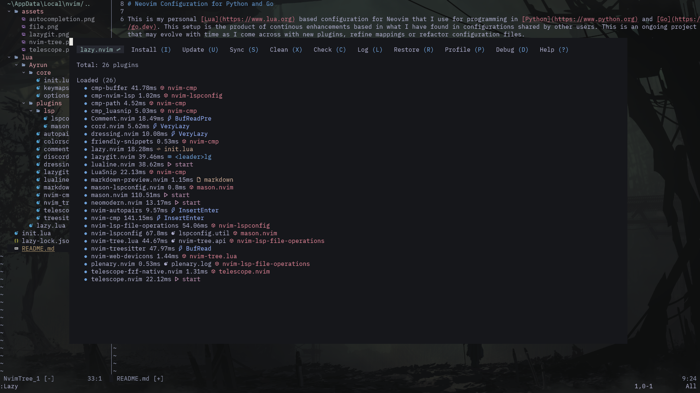
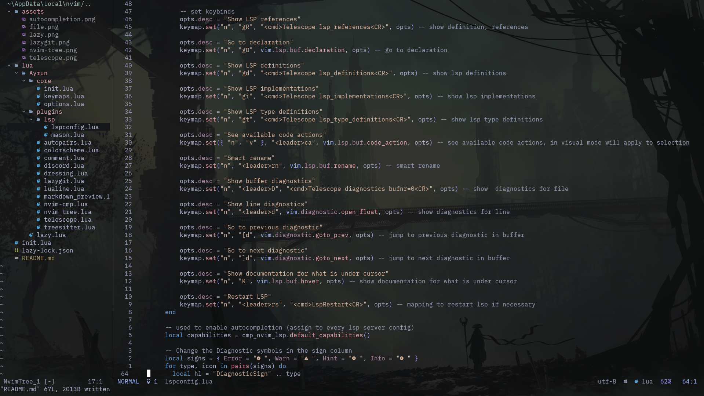
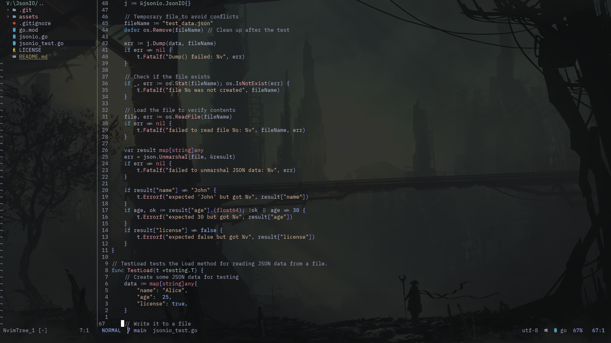
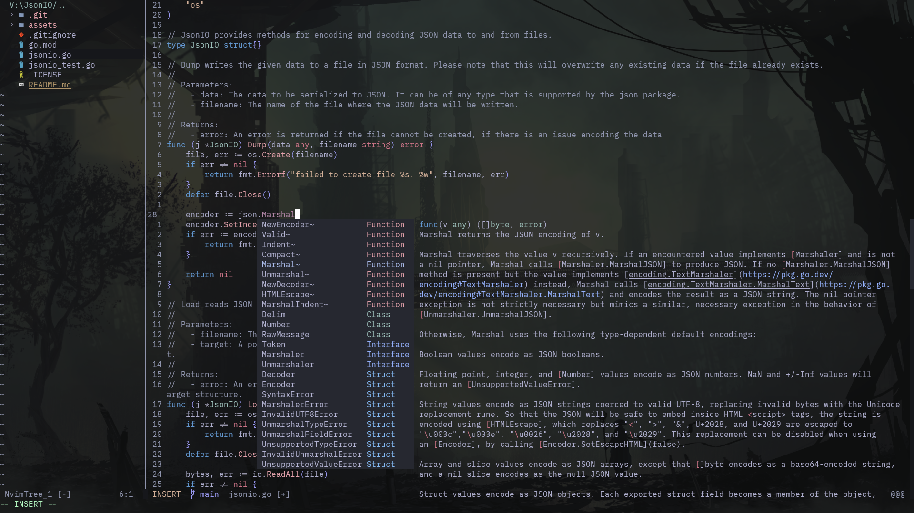
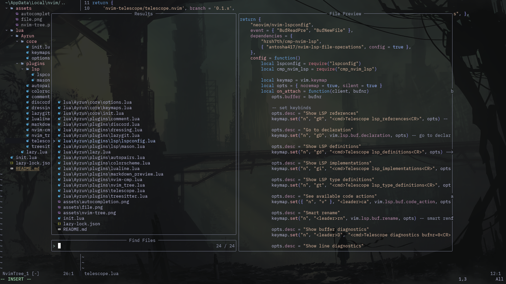
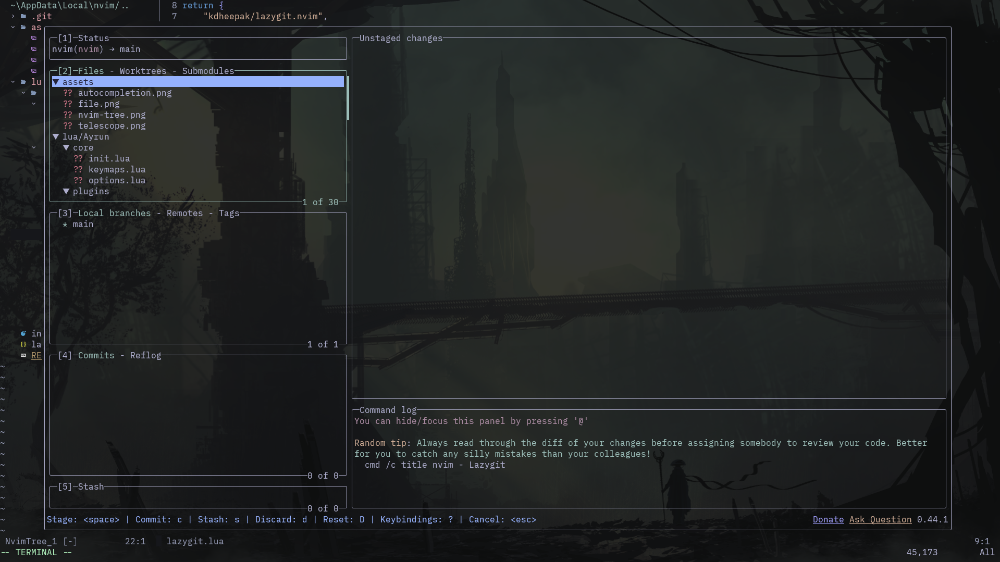

# Neovim Configuration for Python and Go

This is my personal [Lua](https://www.lua.org) based configuration for Neovim that I use for programming in [Python](https://www.python.org) and [Go](https://go.dev). This setup is the product of continous enhancements based in what I have found in configurations shared by other users. This is an ongoing project that may evolve with time as I come across with new plugins, refine mappings or refactor configuration files.

Feel free to fork this repository and adapt it to your own needs.

---

#### Lazy Plugin Manager

</img>

---

#### RosePrime( inspired by Primeagen's color scheme ) powered by Neomodern

</img>

---

#### Syntax highlighting using Treesitter

</img>

---

#### Autocompletion using nvim-cmp

</img>

---

#### File explorer powered by Nvim Tree

</img>

---

#### Fuzzy finder powered by Telescope

</img>

---

#### Git Integration using LazyGit

</img>

---

Other plugins that I didn't mention above are as follows:

- [mason.nvim](https://github.com/williamboman/mason.nvim) plugin manager for managing LSP servers.

- [nvim-autopairs](https://github.com/windwp/nvim-autopairs) for auto-closing backets, quotes, e.t.c.

- [Comment.nvim](https://github.com/numToStr/Comment.nvim) for commenting lines.

- [cord.nvim](https://github.com/vyfor/cord.nvim) discord rich presence written in rust( you guys are everywhere istg )

- [dressing.nvim](https://github.com/stevearc/dressing.nvim) for improving the default UI.

- [lualine.nvim](https://github.com/nvim-lualine/lualine.nvim) statusline which is blazingly fast and written in lua.

- [markdown-preview](https://github.com/iamcco/markdown-preview) for previewing markdown files.

- [gitignore.nvim](https://github.com/wintermute-cell/gitignore.nvim) for generating gitignore files inside of neovim.

---
